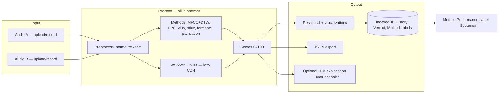

# 02 — Architecture — Sound Mirror

## Status

- Architecture status: Detected (evidence-backed) — keep-as-is recommendation is Candidate
- Stack status: Detected
- Last updated: 2026-06-10
- Human acceptance required before further implementation: yes

## Architecture Summary

Fully static browser app. `index.html` + `style.css` form the shell; vanilla ES modules in `src/` do everything client-side: audio capture/decoding (Web Audio), DSP feature extraction, DTW alignment, scoring, IndexedDB history, and lazy ONNX wav2vec inference via `@xenova/transformers` from CDN. Optional LLM explanation calls a user-configured OpenAI-compatible endpoint directly from the browser. No backend, no build step; tests run in Node via vitest.

## Current Detected Stack

| Layer | Detected technology | Evidence |
| --- | --- | --- |
| Frontend | Vanilla JS ES modules, single `index.html`, `style.css` | repo root, `src/*.js`, no framework deps |
| Build | none (no bundler) | `package.json` has only vitest |
| Tests | vitest ^1.6.0 | `package.json`, `tests/*.test.js` |
| Data | IndexedDB (History Entries incl. audio blobs) | `src/historyStore.js` |
| AI | `@xenova/transformers` via CDN importmap (wav2vec ONNX, ~90MB, lazy) | `src/wav2vecMethod.js`, ADR-0002 |
| LLM (optional) | user endpoint `GET /v1/models`, `POST /v1/chat/completions` | README, LLM Settings page |
| Auth | none (local-only) | no auth code |
| Deploy | Vercel static | `vercel.json` |

## Recommended Candidate

- Keep the detected stack unchanged. No migration. Rationale: requirements (static, local, language-agnostic DSP) are fully met; zero build step keeps maintenance minimal.
- Status: Candidate — pending Lucy confirmation.

## Module Map

```txt
main.js (1081 ln, orchestration/UI wiring)
 ├─ audio.js          capture/decode/preprocess
 ├─ dsp.js (744 ln)   MFCC-39, LPC, VUV, spectral flux, formants, mel, pitch
 ├─ dtw.js            dynamic time warping
 ├─ methods.js        METHOD_DEFS + runners (async runAnalysis)
 ├─ wav2vecMethod.js  lazy ONNX loader + cosine similarity
 ├─ methodEvaluator.js Spearman: Scores vs Verdicts (pure, tested)
 ├─ historyStore.js   IndexedDB
 ├─ ui.js             verdict strip, performance panel, rendering
 └─ visualizations.js charts/spectrograms
```

## System Diagram



## R&D Tasks

| Task | Risk | Status |
| --- | --- | --- |
| R&D: wav2vec model size/latency acceptable on Lucy's machines? | UX of ~90MB first load | Open — verify on real hardware |
| R&D: vitest cannot run in Linux sandbox (rollup native binding built on Windows) | agents can't verify tests here | Open — run `npm test` on Windows or `npm ci` in sandbox |

## Architecture Gate Checklist

- [x] Existing stack detected with evidence
- [x] Candidate recommendation not treated as accepted
- [ ] Human accepted stack before further implementation
- [x] Decisions recorded in `context/05-decisions.md`
